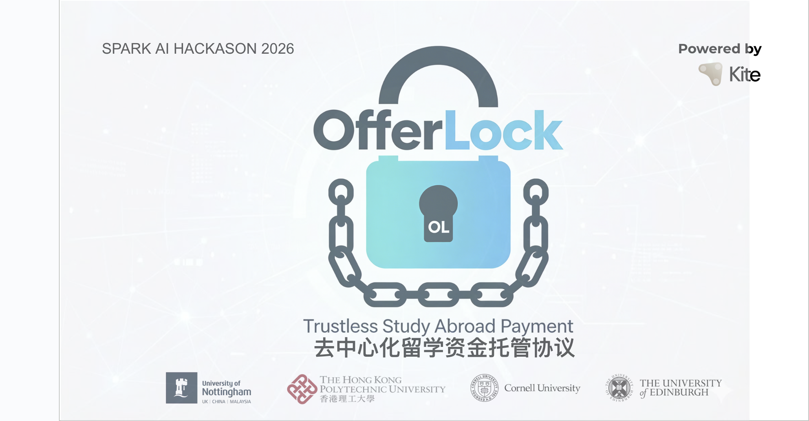

# OfferLock
OfferLock: Trustless Study Abroad Payment Protocol
# Project Name

[English](README_en.md) | [简体中文](README_en.md)


---


## 跨境教育支付的去中心化托管协议
Make Trust Visible | 让信任可见

[Kite AI Chain](https://img.shields.io/badge/Network-Kite%20AI%20Testnet-blue)


## Demo 视频

点击图片观看完整演示（YouTube）：

[](https://youtu.be/TvpC55reank)

## 演示文稿 (PPT)

点击下方图片在线查看完整 PPT（Google Slides，可直接翻页、缩放、演示模式）：

[](https://docs.google.com/presentation/d/1rDBksBbcsruE9Eu1aFiEAl0PmBiHjx8vF8pqxRf-1c4/view?usp=sharing)

或者直接打开链接预览：
[在线查看完整 PPT（推荐）](https://docs.google.com/presentation/d/1rDBksBbcsruE9Eu1aFiEAl0PmBiHjx8vF8pqxRf-1c4/view?usp=sharing)

备用下载方式（原始文件，约 30 MB）：
- [下载 .pptx 文件](https://docs.google.com/presentation/d/1rDBksBbcsruE9Eu1aFiEAl0PmBiHjx8vF8pqxRf-1c4/export/pptx)

```
## 👥 5. Team / 团队成员

We are a passionate, multi-disciplinary team building the future of Invisible Web3 experiences on Kite AI.

我们是一支跨领域、充满热情的团队，致力于在 Kite AI 上打造无感 Web3 体验。

| Role / 角色                              | Name / 姓名          | X (Twitter)                          | Telegram             | Bio Snippet / 简介 |
|------------------------------------------|----------------------|--------------------------------------|----------------------|--------------------|
| Product Strategist & Business Architect<br>产品战略与商业架构设计 | Alex Fan            | [@itsAlexFan](https://x.com/itsAlexFan) | @itsAlexFan         | Cornell University 
| Technical Lead & GTM <br>技术负责人及市场推广负责人 | Fred Huang          | [@FrankFred834567](https://x.com/FrankFred834567) | @frankhyn123     | The Hong Kong Polytechnic University (PolyU) |
| Web3 Frontend Development & UI/UX<br>Web3前端开发 & UI/UX | 虎虎 (ToraInX)      | [@planning8848](https://x.com/planning8848) | —                | Tongji University |

### Connect with the team / 联系我们
Feel free to reach out on X or Telegram for collaborations, feedback, or just to say hi! 🚀

我们欢迎任何合作、反馈或交流～

Built with ❤️ by the OfferLock team on Kite AI Testnet.

## 📄6. License / 开源协议

This project is licensed under the MIT License - see the [LICENSE](LICENSE) file for details.

本项目采用 MIT 许可协议 - 详细内容请参阅仓库中的 [LICENSE](LICENSE) 文件。
