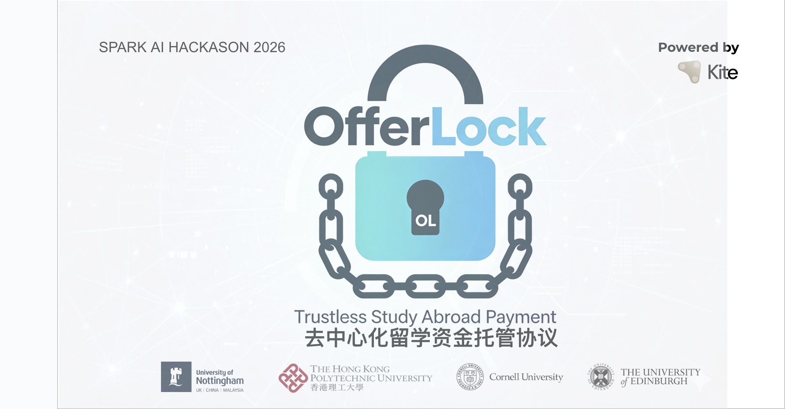

# OfferLock

OfferLock: Trustless Study Abroad Payment Protocol

# Project Name

[中文版](README_zh.md) | English

---

## Zero-Risk Study Abroad Payment Escrow Protocol

Code is Law. Trustless Study Abroad Payment. Code is Law. Eliminating trust crises in study abroad payments.

[Kite AI Chain](https://img.shields.io/badge/Network-Kite%20AI%20Testnet-blue)


## Demo Video

Click the image to watch the full demo (YouTube):

[](https://youtu.be/TvpC55reank)

## Presentation (PPT)

Click the image below to view the full PPT online (Google Slides, supports page turning, zooming, and presentation mode):

[](https://docs.google.com/presentation/d/1rDBksBbcsruE9Eu1aFiEAl0PmBiHjx8vF8pqxRf-1c4/view?usp=sharing)

Or open the link directly to preview:
[View Full PPT Online (Recommended)](https://docs.google.com/presentation/d/1rDBksBbcsruE9Eu1aFiEAl0PmBiHjx8vF8pqxRf-1c4/view?usp=sharing)

Alternative download method (original file, ~30 MB):

- [Download .pptx file](https://docs.google.com/presentation/d/1rDBksBbcsruE9Eu1aFiEAl0PmBiHjx8vF8pqxRf-1c4/export/pptx)

## 🌟 1. Project Overview / Project Overview

OfferLock is a decentralized escrow protocol designed for the **$50B study abroad service market**. By combining **AI Oracles** and **Kite AI Smart Contracts**, we solve the trust deficit between students and agencies through a risk-reversed payment model.

OfferLock is a decentralized escrow protocol specifically designed for the **$50 billion study abroad services market**. By combining **AI Oracle** with **Kite AI Smart Contracts** and utilizing a risk-reversal payment model, we fundamentally resolve the trust gap between international students and intermediary agencies.

### The 40-30-30 "Safety First" Model / 40-30-30 风险反转模型

<p align="center">
  
  <br>
  <small>40% Signing → 30% AI Verification → 30% Enrollment Completion</small>
</p>

- **40% Signing (签约启动)** : Funds released to secure the agreement and cover initial operations. / 签约即释放，保障服务正式启动及基础运营成本。
- **30% AI Verified (AI 自动核验)** : Automatically released only when the **AI Oracle** validates the university offer letter's authenticity. / 当 **AI 预言机** 验证录取通知书真实性后自动释放，实现硬核风控。
- **30% Completion (入学结案)** : Released upon successful enrollment to close the service loop. / 学生确认入学后释放尾款，确保服务最终闭环。

## 📖 2. Product Whitepaper & Core Logic / 项目白皮书 & 核心逻辑

**Code is Law. Trustless Study Abroad Payment.**  
A programmable escrow protocol for study abroad funds based on the Kite AI chain, using code to rebuild payment trust in the $50 billion market.

### 1. Why Are We Doing This? (Vision & Pain Points)

We are not building a simple payment tool; we are solving a "trust crisis."

Pain Point One: Funds Exposed

* In the traditional model, students must prepay 100% of the fees to the agency. If the agency disappears or provides subpar service, students face a total loss (industry refund dispute rate >15%).
* OfferLock Solution: Funds are not sent to the agency's pocket but are locked in an on-chain contract.

Pain Point Two: No Delivery Standard

* Agency services are "non-standardized products," making results difficult to quantify.
* OfferLock Solution: Introduce an AI verification layer, making the Offer the sole trigger for fund release.

Pain Point Three: Barrier Too High

* International students don't understand Crypto and lack Gas fees.
* OfferLock Solution: Use the Kite AI Account Abstraction SDK to enable seamless, gasless payments.

### 2. Core Mechanism: The Three-Phase Fund Release Model (The 40-30-30 Protocol)

We have restructured the traditional study abroad agency's fee model, proposing a "Risk-Reversal" business model. Through smart contracts, we transform the 100% risk originally borne by students into a fair game of pay-for-performance.

Stage 1: Initiation & Signing (Initiation) —— Release 40%

* Trigger Condition: Student deposits funds and signs the contract.
* Fund Flow: 40% is immediately released to the service provider.
* Business Logic: Covers the agency's basic labor costs (documentation, school selection, communication), ensuring service providers have the motivation to start services and preventing quality agencies from struggling.

Stage 2: Core Delivery (The "AI Moment") —— Release 30%

* Trigger Condition: AI Oracle verification passes (student uploads Offer PDF -> AI identifies authenticity -> triggers on-chain signal).
* Fund Flow: 30% is released to the service provider.
* Business Logic: This is the core value point of the service. "No rabbit, no eagle," completely eliminating false promises.

<p align="center">
  
</p>

Stage 3: Perfect Closure (Enrollment) —— Release 30%

* Trigger Condition: Student confirms enrollment or the service period ends without dispute.
* Fund Flow: The remaining 30% is released.
* Business Logic: Ensures service completeness (assisting with visas, accommodation, and other follow-up matters), preventing "killing without burying."

### 3. Legal & Compliance Engineering (Legal Engineering)

Non-Custodial Funds: The OfferLock platform does not touch user funds. All funds are locked in smart contracts; only code logic (Code) can move funds. Platform failure does not affect user asset security.

### 4. Go-to-Market Strategy (Go-to-Market)

We do not attempt to convince arrogant traditional giants; we aim to empower challengers.

* Target Customers: Independent study abroad consultants, boutique studios, Web3 community education institutions.
* Core Value: "Trust as a Service".
  * For small and medium-sized agencies: Using OfferLock = gaining bank-level trust endorsement = reducing customer acquisition costs.
  * For students: Gaining 100% financial security.

### 5. Roadmap (Roadmap)

* Phase 1 (Hackathon MVP):
  * Implement the core 40-30-30 fund flow.
  * Run through the PDF upload -> AI verification -> automatic payment process.
  * Complete Kite AI Account Abstraction integration.

* Phase 2 (V2.0):
  * SLA Editor: Allows agencies to customize installment ratios (e.g., 50-50).
  * Reputation System: Agency credit scoring system based on on-chain delivery records.

## 🛠 3. Technical Stack / Technical Architecture

Built with a focus on **"Invisible Web3 Experience"**, we deeply leverage the core components of the Kite AI ecosystem:

This project focuses on building an "Invisible Web3 Experience," deeply utilizing the core components of the Kite AI ecosystem:

- **Settlement Layer (结算层)**  
  Deployed on Kite AI Testnet.  
  Non-custodial escrow ensures platform-level security.  
  **Deployed on the Kite AI Testnet, utilizing a non-custodial protocol to ensure funds cannot be misappropriated by the platform.**

- **UX Innovation (体验层)**  
  Integrated Kite Account Abstraction (AA) SDK for Gasless Payments.  
  Allows students to pay with USDT without holding native tokens.  
  **Integrated Kite Account Abstraction SDK, enabling gasless payments via Paymaster, allowing international students to complete transactions without holding native tokens.**

- **Verification Layer (验证层)**  
  An LLM-based AI Oracle that converts off-chain PDF data into on-chain trust signals.  
  **An AI Oracle based on a Large Language Model, converting PDF admission letters into on-chain trust signals to trigger contract state changes.**

#### Contract Verification & Release Logic / Contract Verification & Release Logic

The core release function `releaseNextMilestone` is called by the auditor and includes multiple verifications to ensure funds are only released to the intermediary when conditions are met.

**🔍 Summary of Key Verification Points (verify section):**

- `onlyAuditor`: Only the auditor can call this function (this is the primary "verification permission" control)
- `onlyExistingOrder`: The order must exist
- `require(o.status == Funded || InProgress)`: The order must be in Funded or InProgress status
- `require(o.currentMilestone < milestoneAmounts.length)`: There are still unfinished milestones
- `require(o.depositedAmount - o.releasedAmount >= amount)`: The remaining balance is sufficient for this release

These checkpoints collectively implement a secure closed loop of "AI verification triggers release," preventing unauthorized, insufficient balance, or state-error fund releases.

## 🚀 4. Quick Start / 快速开始

### Deployment Information / 部署信息

- **Contract Address (合约地址)**: `0xDECEd7A01D61aCcE2C51F86f6a816757E762d1F0`
- **Network (网络)**: Kite AI Testnet (Chain ID: 2368)
- **Explorer (浏览器)**: Verified Contract on [Kitescan](https://testnet.kitescan.ai/address/0xDECEd7A01D61aCcE2C51F86f6a816757E762d1F0)  
  (Click directly to view contract code, transaction records, etc.)

### Local Development / 本地开发

```bash
# Clone the repository (replace with your actual GitHub repo URL once created)
git clone https://github.com/yanzhuchen96-creator/offerlock.git

# or if using SSH:
# git clone git@github.com:[your-username]/offerlock.git

cd offerlock

# Install dependencies
npm install

# Start development server (usually opens at http://localhost:5173 or similar)
npm run dev
```

## 👥 5. Team / 团队成员

We are a passionate, multi-disciplinary team building the future of Invisible Web3 experiences on Kite AI.

We are a cross-disciplinary, passionate team dedicated to building seamless Web3 experiences on Kite AI.

| Role / 角色                              | Name / 姓名          | X (Twitter)                          | Telegram             | Bio Snippet / 简介 |
|------------------------------------------|----------------------|--------------------------------------|----------------------|--------------------|
| Product Strategist & Business Architect<br>产品战略与商业架构设计 | Alex Fan            | [@itsAlexFan](https://x.com/itsAlexFan) | @itsAlexFan         | Cornell University 
| Project Design & Industry Analyst<br>项目核心构想设计与行业分析 | Riley琦琦           | [@rileyqiqi](https://x.com/rileyqiqi)   | @rrrileywang        | University of Edinburgh |
| Technical Support & Product Promotion<br>技术支持与产品宣传 | Fred Huang          | [@FrankFred834567](https://x.com/FrankFred834567) | @frankhyn123     | The Hong Kong Polytechnic University (PolyU) |
| Smart Contract Development & On-chain Integration<br>智能合约开发与链上集成 | Joe Chen            | [@cyz496](https://x.com/cyz496)         | @cydot0906          | The Hong Kong Polytechnic University (PolyU) |
| Web3 Frontend Development & UI/UX<br>Web3前端开发 & UI/UX | 虎虎 (ToraInX)      | [@planning8848](https://x.com/planning8848) | —                | Tongji University |

### Connect with the team / 联系我们

Feel free to reach out on X or Telegram for collaborations, feedback, or just to say hi! 🚀

We welcome any collaborations, feedback, or exchanges!

Built with ❤️ by the OfferLock team on Kite AI Testnet.

## 📄6. License

This project is licensed under the MIT License - see the [LICENSE](LICENSE) file for details.

This project is licensed under the MIT License - see the [LICENSE](LICENSE) file for details.